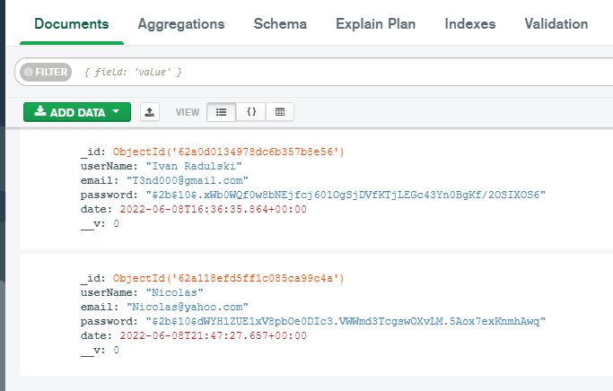

<<<<<<< HEAD
# Title and Cover Page


        ADVANCED DATABASE SYSTEM (QHO541)

    Solent University Manchester Branch

    Student name: Ivan 

    Student number:10103365

    Module title: Advanced Database System (QHO541)

    Module leader: Dr Ajmal Gharib

    Web application link: http://localhost:3001/
    Git Repository: https://github.com/Tervel10/Assessment-
    


# Introduction 
    Creating of this project and the request for this module give us vision for what developers job is. Giving us a clue of structure and criteria for planning and create a full stack web application. Developing and design from zero it wasn`t a easy task to do, creating a web pages, connected to each other with paths and routes with secured connection to database, installing scripts and dependencies gives a lot of questions and errors which had take time to understand and fix it. But satisfaction of achieving results and building a knowledge worth it.

# System overview 
    As a full stack web application should be created front end related to the client, back end ralated to server software and  both needs connected to data base 

    - As a data server for this project its used  MongoDB with localhost:27017 


    In database used for this project have only one added member
    


    Registering a new member in our database from the website by pressing a Submit button.
    


    Requesting for a real Email address 
    


    As can see in our data is added a new object with the same details submited from the website with bcrypt password for secure purpose 
    
# Key Desing Decisions
    for this project has been used .ejs
    NodeJS backend framework has been created on Express.js as a standart framework which provide features to create a web app its easy to use and frovides various feautures which make a developer work easier. Its very flexible and light framework to use.
    Express.js gives advantage as easily use and light framework to others frameworks as Koa, Hapi.js, Meteor.js and other. 
    
  

    For DB we are using json export file type, Mongoose module is used to connect the backend and database comminication, Mongoose is a object database modeling traslating codes from NodeJS to MongoDB data base   

    
    
# Security and scalability


# Conclusion and Reflection


```js
    
=======
