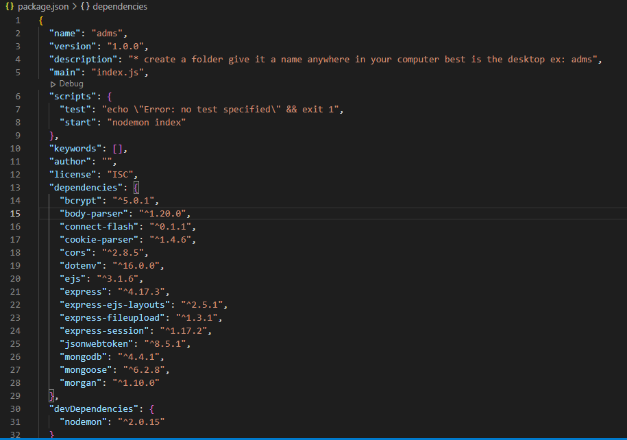

# Car auction 

For Advanced Database module neeed to create a full stack web-application connceted with dataset.
 
# Website main ideas
 
In order to create a website - main idea of this project is to have a car auction website where people create a membership so they can come to live auction and bet for cars desire car.
 
 * Users - are able to create a new membership, log in, log out and see Car data
 
 *Administrator - can see the dataset, delete, edit. also can add Car data for newest offers

Creating and moderating - in purpose for this module have been used a Visual Studio code with additional support  installations, and Node JS

# Running the website
 
 * The Car Auction web site is available to be seen in GitHub repository (Tervel10/Assessment-) can be downloaded and used from there to any computer, for further use by downloading the files on your computer from the repository and uploaded  init Virtual Studio Code:
 
    *Commands in VSCode Terminal after uploding the files
        -npm install
        -npm start
    
        
After this steps  MondoDB server need to be already connected with the website which is available on - http://localhost:3001/ in any internet browser

your package.json have to got installed the same packages as the picture bellow 

# Web application files and related connections
  
  1. Controllers
 * carControllers.js - here has created all routes that actually run the codes for different functions as : edit, create, delete, submit log in, log out, user data and so on.

  2. Models 
 * carModel.js - creating a schema for organising DB
 * database.js - showing the proccess  of our DB connection
 * User.js - create a user connected to DB and requesting user information back
  
  3. Routes 
 * carRoutes.js - website routes defining for our pages and connections with controllers
 
  4. Views 
    
 * in here are all pages used to create a full website for car auction: login page, register page and soo on
 * layouts/main.ejs - main page of the website 
 
  5. .env  - a basic text sistema for manipulating the environment constants in your applications and connection to DB
  
  6. index.js - file which is handling funtions and routes to start up the application
  
  7. package-lock.json - it specifies the precise tree that was created, allowing subsequent installs to produce identical trees independent of intermediary dependency modifications

  8. package.json - it stores project-related metadata and is used to manage the project's dependencies, scripts, version, and much more.

